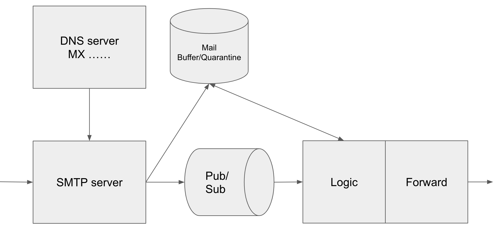

# w00tcamp-PTSM
Not SMTP, but PTSM (Pay To Spam Me).

Stop spam &amp; get your deserved financial reward for reading mails. Let senders pay for emailing you.



## References / credits to
1. https://github.com/decke/smtprelay
1. https://cloud.google.com/compute/docs/containers/deploying-containers

## Local running

```bash
export SERVER=ptsm.hermanbanken.nl
export CORP=hermanbanken.nl
export COUNTRY=NL
openssl req -x509 -sha256 -nodes -days 3650 -newkey rsa:2048 -keyout private.pem -out certificate.crt -subj "/CN=$SERVER/O=$CORP/C=$COUNTRY"

make build
./bin/ingest-darwin-arm64 -local_cert certificate.crt -local_key private.pem -hostname ptsm.hermanbanken.nl
```

## PTSM.org
Hosted mailbox/forwarder
Add credit. Pay 0.001$ per forwarded email.
Set rules, domains, whitelists, etc.
Bounces for 404?
Careful with displaying emails. XSS, embedded url loading. Tracking pixels.
